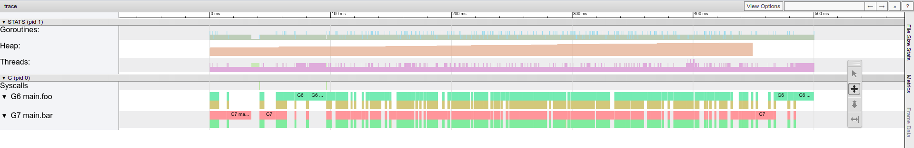
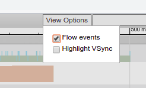
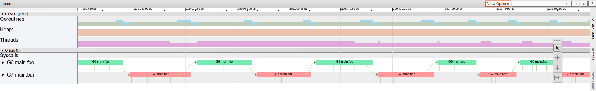

# Intro to Go Lab 2: Basic concurrency

> If you're stuck look at examples on [Go by Example](https://gobyexample.com/)

# Using the lab sheet

There are two ways to use the lab sheet, you can either:

- [create a new repo from this template](https://github.com/UoB-CSA/intro-to-go-lab-2/generate) - **this is the recommended way**
- download a [zip file](https://github.com/UoB-CSA/intro-to-go-lab-2/archive/master.zip)

Each question is rated to help you balance your work:

- :red_circle::white_circle::white_circle::white_circle::white_circle: - Easy, strictly necessary.
- :red_circle::red_circle::white_circle::white_circle::white_circle: - Medium, still necessary.
- :red_circle::red_circle::red_circle::white_circle::white_circle: - Hard, necessary if you're aiming for higher marks.
- :red_circle::red_circle::red_circle::red_circle::white_circle: - Hard, useful for coursework extensions.
- :red_circle::red_circle::red_circle::red_circle::red_circle: - Hard, beyond what you need for any part of the coursework.

## Go concurrency syntax

```go
go someFunc()
```

Start a new goroutine. `someFunc` has to be a void function.

```go
channel := make(chan int)
```

Make a new channel to be used to communicate between two goroutines. You can think of `make` as Go's version of `malloc`. It allocates memory for objects. However, you don't have to worry about freeing the memory as Go has a built-in garbage collector.

```go
channel := make(chan int, 6)
```

Make a new **buffered** channel with buffer of size 6 (i.e. capable of storing 6 ints).

```go
channel <- 5
```

Send one message (the integer 5) to the channel.

```go
number := <-channel
```

Receive one message from a channel and assign it to a new variable called `number`.

```go
sendOnly chan<- int
```

Channel of type `chan<-` is send-only. Receiving a message from a channel of that type will cause a compiler error.

```go
receiveOnly <-chan int
```

Channel of type `<-chan` is receive-only. Sending a message to a channel of that type will cause a compiler error.

## Question 1 - Messages :red_circle::white_circle::white_circle::white_circle::white_circle:

### Question 1a

Open `messages.go`. In `messages.go` we create a channel for strings and then use it to pass 3 strings between `sendMessages` and `main`.

Run the program and make sure you fully understand the output.

### Question 1b

Modify the function `main()` so that only 2 messages are received. Do not modify the `sendMessages()` function.

Run the program and explain the output. Look at which messages have been received **and** which ones have been sent.

### Question 1c

Modify the function `main()` so that 4 messages are received. Do not modify the `sendMessages()` function.

Run the program and explain what has happened and why.

### Question 1d

Modify the function `main()` so that 3 messages are received. Modify the `make` function call in main so that `messages` is a **buffered** channel of strings with buffer size 3. Do not modify the `sendMessages()` function.

Run the program and explain how the result differs compared to the original solution with no buffered channels.


### **EXTRA** Question 1e

Watch the [video on 'Debugging with Delve'](https://www.ole.bris.ac.uk/bbcswebdav/courses/COMS20008_2023_TB-1/CONTENT_2023/tuts/DebuggingWithDelve/debugging_with_delve_1.mp4) and play around with some of the debug commands on the programs that you have written in Lab 1.

## Question 2 - Ping Pong :red_circle::white_circle::white_circle::white_circle::white_circle:

### Question 2a

Open `ping.go`. It's a skeleton for a "ping-pong" program. Implement one round of ping-pong: `foo()` should send a string `ping` to `bar()` and `bar()` should respond with the string `pong`. After that `foo()` should receive a `pong`.

Complete your solutions by implementing `foo()` and `bar()`. Don't forget to wire things up in the `pingPong()` function. Do not modify `main()`.

Include `Println`s to show what has been sent and received. Example output:

```bash
$ go run ping.go

Foo is sending: ping
Bar has received: ping
Bar is sending: pong
Foo has received: pong
```

### Question 2b

Make both `foo()` and `bar()` run in infinite loops - i.e. After receiving a `pong` the goroutine `foo()` should send another `ping`. `foo()` and `bar()` should continue doing this infinitely (until the program terminates from `time.Sleep(500 * time.Millisecond)`).

Example output:

```bash
$ go run ping.go

Foo is sending: ping
Bar has received: ping
Bar is sending: pong
Foo has received: pong

Foo is sending: ping
Bar has received: ping
Bar is sending: pong
Foo has received: pong

Foo is sending: ping
Bar has received: ping
Bar is sending: pong
Foo has received: pong

Foo is sending: ping
Bar has received: ping
Bar is sending: pong
Foo has received: pong
...
```

### Question 2c

You may have noticed that `main` talks about tracing. An execution trace in go is similar to a stack trace, except now we have multiple threads of execution and therefore a simple linear trace is no longer very clear. An execution trace allows us to see exactly when each goroutine was running, in which function and how it communicated with other goroutines.

Running your `ping.go` should have generated a `trace.out` file. You can open the trace file with the command `go tool trace trace.out`. This will provide you with a link that you must open in **Chromium or Chrome** - the trace viewer will not work in other browsers.

Explain how the trace relates to the code you have written.

**WATCH THE VIDEO ON TRACING IN GO** - [it is available on Blackboard](https://www.ole.bris.ac.uk/bbcswebdav/courses/COMS20008_2023_TB-1/CONTENT_2023/tuts/TracingInGo/HowToMakeAtraceOfMultipleThreads.mp4)

<details>
    <summary>Hint</summary>

Click on `Goroutine analysis`, `main.foo`, and then whatever number it says under the `Goroutine` heading. You should see a trace like this:



Firstly, enable `flow events` under `view options` in the top-right corner. This will display arrows that indicate channel communication and use of the `go` keyword.



To navigate the trace you will need to use your keyboard. Use W and S to zoom in and out (it will zoom to where your mouse is), and A and D to move left and right. Now zoom in so that you see a part of the trace that looks like this:



If your ping-pong code is correct your trace should look very similar to the one above. Each block means that the goroutine was running and each arrow represents a message on a channel.

</details>

## Question 3 - for-select :red_circle::white_circle::white_circle::white_circle::white_circle:

Sometimes we do not know which channel to receive from. The example program `select.go` illustrates this problem. We have two goroutines: `fastSender` and `slowSender`. In `main` we would like to receive all messages from the two goroutines but we do not know when each message arrives. A select statement is a solution to this problem. Given a list of cases it will wait until it finds one that can be executed and then it will run the code after the `:` . In this program the two possible cases are "string received from `strings`" and "integer received from `ints`" :

```go
for {  // An empty for is Go's equivalent of 'while(true).'
    select {
    case s := <-strings:
        fmt.Println("Received a string", s)
    case i := <-ints:
        fmt.Println("Received an int", i)
    }
}
```

### Question 3a

Run the program and explain the output.

### Question 3b

Write a new function `func fasterSender(c chan<- []int)` that sends the slice `[1, 2, 3]` to `main` every 200 ms. Add another case in the select statement for receiving these slices from the `fasterSender`.

Run your program. Ensure that your result looks similar to this example output:

```bash
$ go run select.go

Received a slice [1 2 3]
Received a slice [1 2 3]
Received an int 0
Received a slice [1 2 3]
Received a slice [1 2 3]
Received an int 1
Received a slice [1 2 3]
Received a slice [1 2 3]
Received a slice [1 2 3]
Received an int 2
Received a slice [1 2 3]
Received a slice [1 2 3]
Received a string I am the slowSender
Received an int 3
Received a slice [1 2 3]
Received a slice [1 2 3]
Received a slice [1 2 3]
Received an int 4
Received a slice [1 2 3]
Received a slice [1 2 3]
Received an int 5
Received a slice [1 2 3]
Received a slice [1 2 3]
Received a slice [1 2 3]
Received an int 6
Received a slice [1 2 3]
Received a slice [1 2 3]
Received a string I am the slowSender
Received an int 7
Received a slice [1 2 3]
Received a slice [1 2 3]
Received a slice [1 2 3]
Received an int 8
Received a slice [1 2 3]
Received a slice [1 2 3]
Received an int 9
...
```

### Question 3c

A [default case](https://gobyexample.com/non-blocking-channel-operations) is a special case in the select statement that will be executed if and only if no other cases could be executed. Add a default case to the select statement containing the following code:

```go
fmt.Println("--- Nothing to receive, sleeping for 3s...")
time.Sleep(3 * time.Second)
```

Run the program and explain the output.

### Question 3d

Make all of your channels **buffered**. Set the buffer size to 10.

Run the program and explain the output.

### **OPTIONAL** Question 3e

Create traces for all versions of the select program and explain how they correspond to the code you have written.

## Question 4 - Quiz :red_circle::red_circle::white_circle::white_circle::white_circle:

Open `quiz.go`. It's a sample solution to the quiz task that you might remember from lab 1. Today we will explore advanced concurrency concepts and language features to improve our quiz.

Your task is to use the for-select construct demonstrated in `select.go` to satisfy the following new quiz requirements:

1. The quiz should only run for 5 seconds. After that time the final score should be printed to the user.

2. The quiz program must terminate immediately after the 5 seconds have elapsed. Specifically, it **must not** wait for the user's answer to the current question before terminating.

### Question 4a

As part of the `ask()` function, we have to wait for the user's input. The function call `scanner.Scan()` will block until it receives a line of text (a string with a newline character at the end). An operation that may need to wait for some event is known as a *blocking operation*. Other blocking operations include channel send/receive operations (on a non-buffered channel send operation may block and wait for the matching receive and vice versa).

However, we described above that we would like to check the timer and terminate the program while the user is thinking about the answer. Goroutines offer a solution to this problem. If we turn `ask` into a goroutine it will be able to block and wait for user input while `main` will be able to continue to work.

Modify the quiz program so that ask is always called as a goroutine - i.e. ask is always of the form `go ask(...)`. Verify that the quiz still works as expected and that the score printed out is correct.

<details>
    <summary>Hint 1</summary>

You have to modify both `main` and `ask`.

</details>

<details>
    <summary>Hint 2</summary>

Recall that to return from a goroutine you have to use a channel.

</details>

<details>
    <summary>Hint 3</summary>

Look at the [time package](https://golang.org/pkg/time/) to find an appropriate function to help you measure the 5 second timeout. 

</details>

### Question 4b

Using your new `ask` goroutine modify `main` so that it satisfies the 2 new requirements.

Play the quiz. State the number of different threads your solution uses and explain how they communicate with each other.

<details>
    <summary>Hint 1</summary>

In this question, you do not need to modify `ask`.

</details>

<details>
    <summary>Hint 2</summary>

Your new program should use 3 threads:

- A blocking goroutine `ask` that waits for the user's input.
- The `main` goroutine which will hold state such as score and index of the current question.
- A timer thread that will send a message on a channel after 5s.

</details>

<details>
    <summary>Hint 3</summary>

Your select statement will have 2 cases. One for an updated score and one for a timeout message from the timer. You do not need to use a default case here.

</details>


